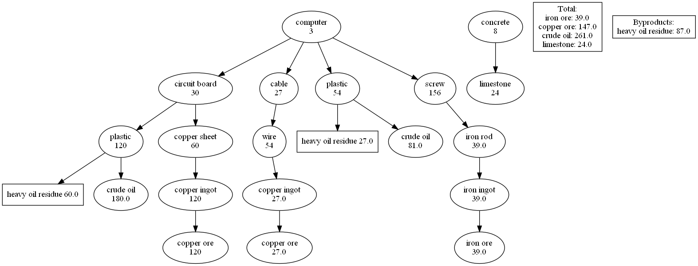

# Satisfactory-Material-Calculator
An application to calculate materials needed in the game Satisfactory
* The output .png file will be saved in the current directory
* Rectangles in a tree represents byproducts
* [Graphviz](https://graphviz.org/) is needed to run the program.

